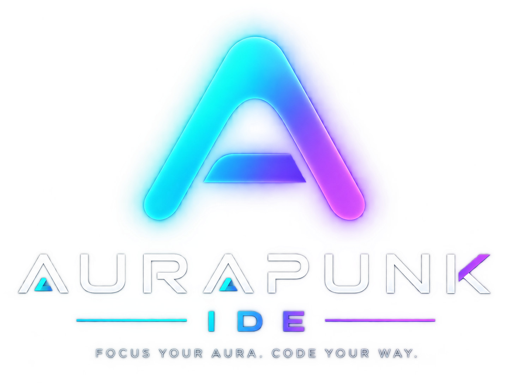
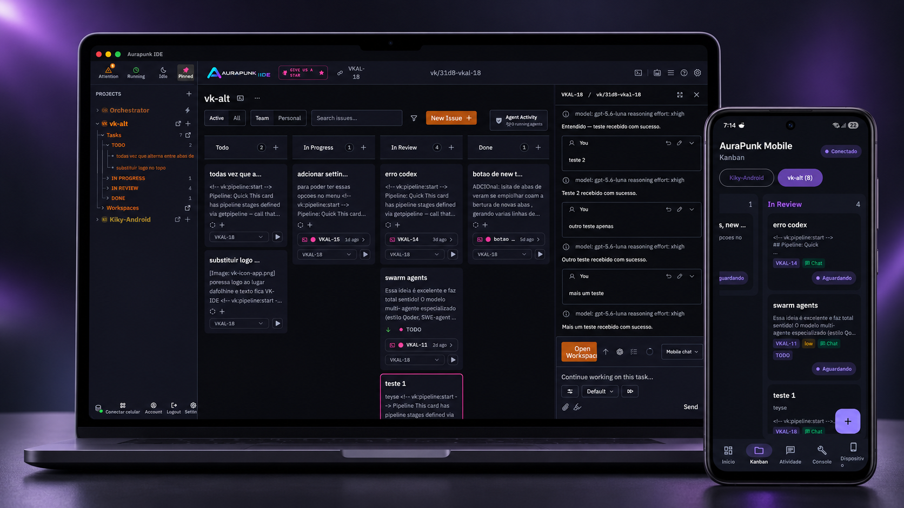
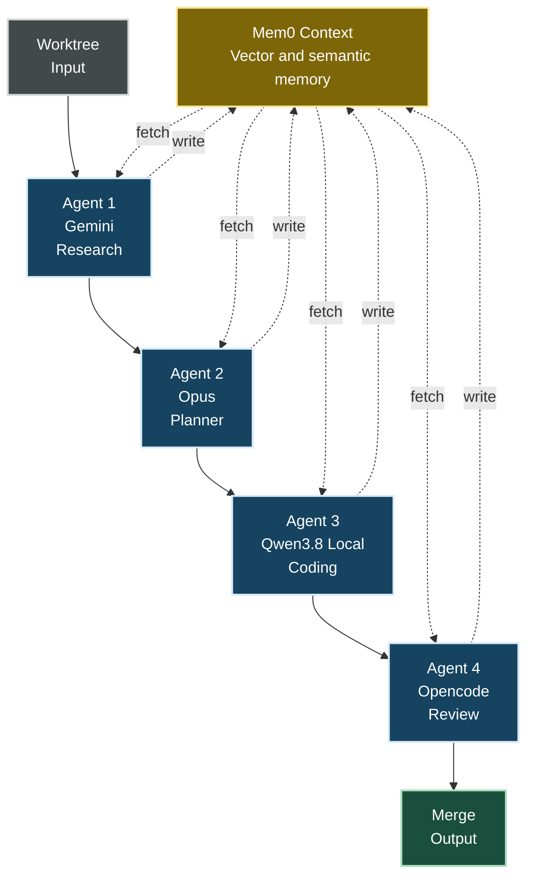

<p align="center">
  
</p>

<h1 align="center">AuraPunk IDE</h1>

<p align="center">
  <b>The free, self-hosted agentic IDE for Kanban-driven multi-agent development.</b>
</p>

<p align="center">
  <a href="https://aurapunk.dev"></a>
  <a href="https://www.npmjs.com/package/aurapunk-ide"></a>
  <a href="https://github.com/flashlan/aurapunk-ide/actions/workflows/test.yml"></a>
  <a href="https://opensource.org/licenses/Apache-2.0"></a>
  <a href="https://github.com/flashlan/aurapunk-ide/issues"></a>
</p>

<p align="center">
  🆓 <b>Free &amp; open source</b> &nbsp;·&nbsp;
  📋 <b>Kanban-based orchestration</b> &nbsp;·&nbsp;
  🤖 <b>Multi-agent</b> — Claude, Codex, Antigravity, OpenCode, Gemini CLI &amp; more, side by side &nbsp;·&nbsp;
  ⚡ <b>Prompt cache-hit architecture</b> &nbsp;·&nbsp;
  🧠 <b>Vector &amp; semantic memory</b> shared across sessions and agents
</p>

<p align="center">
  
</p>

## Download

<p align="center">
  <a href="https://github.com/flashlan/aurapunk-ide/releases/latest/download/Aurapunk-IDE-macos-apple-silicon.dmg"></a>
  <a href="https://github.com/flashlan/aurapunk-ide/releases/latest/download/Aurapunk-IDE-macos-intel.dmg"></a>
  <br/>
  <a href="https://github.com/flashlan/aurapunk-ide/releases/latest/download/Aurapunk-IDE-linux-x64.AppImage"></a>
  <a href="https://github.com/flashlan/aurapunk-ide/releases/latest/download/Aurapunk-IDE-linux-x64.deb"></a>
  <a href="https://github.com/flashlan/aurapunk-ide/releases/latest/download/Aurapunk-IDE-linux-x64.rpm"></a>
  <br/>
  <a href="https://github.com/flashlan/aurapunk-ide/releases/latest/download/Aurapunk-IDE-windows-x64.exe"></a>
  <br/>
  <a href="https://pub-80572bbc4ab94346be24d128e6b22a0f.r2.dev/aurapunk-mobile/aurapunk-mobile-beta.apk"></a>
</p>

<p align="center">
  Prefer a one-line install? No download, no account:
</p>

```bash
npx aurapunk-ide
```

<p align="center">
  Opens the cockpit at <code>http://localhost:3001</code>. Full platform instructions and the
  <a href="https://aurapunk.dev/#download">website download page</a> below.
</p>

### macOS

Open the DMG and drag **Aurapunk IDE** to **Applications**. If macOS shows
“Apple cannot verify the developer”, open **System Settings → Privacy &
Security → Open Anyway**, or run:

```bash
xattr -cr "/Applications/Aurapunk IDE.app"
```

Homebrew users:

```bash
brew tap flashlan/tap
brew install --cask aurapunk-ide
```

### Linux

```bash
chmod +x Aurapunk-IDE-linux-x64.AppImage
./Aurapunk-IDE-linux-x64.AppImage
```

Or `sudo apt install ./Aurapunk-IDE-linux-x64.deb` / `sudo dnf install ./Aurapunk-IDE-linux-x64.rpm`.

### Windows

Run the installer and follow the setup wizard (x64 only).

### Android (Beta) — AuraPunk Mobile

A phone-based control cockpit for the same AuraPunk account: pair with a
Desktop instance or AuraPunk Cloud by QR code, then browse projects, open
cards, chat with running agents, and create new workspaces from your phone.
Install the APK above manually — Cloud-container terminal execution and parts
of the direct P2P bridge are still rolling out.

All installers ship [`SHA256SUMS`](https://github.com/flashlan/aurapunk-ide/releases/download/v0.3.2/SHA256SUMS)
in [release `v0.3.2`](https://github.com/flashlan/aurapunk-ide/releases/tag/v0.3.2) for integrity verification.

## Website and Hosted Plans

**[aurapunk.dev](https://aurapunk.dev)** — AuraPunk IDE itself is free and open source, full stop; nothing above requires an account or a subscription. The website additionally offers optional hosted plans for people who want AuraPunk Mobile to work without a Desktop instance running at home:

- **Free plan** — an account with limited mem0 memory quota, no VM hosting required.
- **Paid hosted instances** — your own cloud VM running the full cockpit, with a larger mem0 quota and disk space for building workspace worktrees, so AuraPunk Mobile can create and drive cards on its own instead of depending on your Desktop being online.
- **Desktop ↔ Mobile sync** — regardless of plan, pair AuraPunk Mobile with a running Desktop or with a Cloud instance by scanning a QR code from **Settings → Devices**.

## Table of Contents

- [Website and Hosted Plans](#website-and-hosted-plans)
- [Background and Credits](#background-and-credits)
- [Overview](#overview)
- [What This Fork Adds](#what-this-fork-adds)
- [Project Memory (mem0)](#project-memory-mem0)
- [Supported Coding Agents](#supported-coding-agents)
- [Chat and Terminal Interaction](#chat-and-terminal-interaction)
- [Usage and Observability](#usage-and-observability)
- [Terminal UI (TUI)](#terminal-ui-tui)
- [Telegram Orchestration](#telegram-orchestration)
- [Gitea and Forgejo Support](#gitea-and-forgejo-support)
- [Development Setup](#development-setup)
- [Credits and Acknowledgments](#credits-and-acknowledgments)
- [License](#license)

## Background and Credits

Following the [shutdown of Bloop's hosted servers](https://vibekanban.com/blog/shutdown), developers were left with orphaned workspaces and broken dependencies. **AuraPunk IDE** is an actively maintained, independent evolution of [BloopAI/vibe-kanban](https://github.com/BloopAI/vibe-kanban) and [dexloom/vibe-kanban-indie](https://github.com/dexloom/vibe-kanban-indie), built for a single-developer workflow: no cloud accounts, no team auth, no remote telemetry. Everything runs on your own machine.

## Overview

Software engineering increasingly means directing coding agents — planning work, spawning a model to implement it, reviewing its diff, and shipping. `AuraPunk IDE` is a kanban board that plans and tracks agent work, plus a workspace runtime that turns each card into a real branch, terminal, and dev server where any of 10+ coding agents (Claude Code, OpenCode, Qwen Code, Codex, Gemini CLI, Antigravity, Copilot, Amp, Cursor, Droid, CCR) executes the plan.

- **Kanban planning** — boards, columns, priorities, tags, sub-issues, and pipelines.
- **Agent workspaces** — each card launches a branch, terminal, dev server, and an agent following a configurable pipeline.
- **Diff review** — inline comments, diffs, a preview browser, and a manual-review stage before any merge or PR.
- **Cross-session project memory (mem0)** — agents recall and persist verified facts, keyed per repository, shared across CLIs.
- **Usage and observability** — a `Settings → Usage` dashboard with per-day activity, per-agent bars, and progress.
- **Workspaces, PRs, and merge** — open PRs (GitHub or Gitea/Forgejo) with AI-generated descriptions.
- **Terminal and phone control** — a [TUI cockpit](#terminal-ui-tui) and [Telegram escalation](#telegram-orchestration).


## What This Fork Adds

- **Server infrastructure** — upstream sunsetting, Indie runs locally → **fully offline, self-hosted runtime**
- **Cross-session memory** — ephemeral, or none → **native `mem0` with Qdrant and a NetworkX graph**
- **Prompt cache-hit architecture** — not present → **deterministic memory-prefix injection preserves cache hits**
- **Telemetry and observability** — none, or minimal → **`Settings → Usage` dashboard: tokens, activity heatmaps, per-agent breakdown**
- **Coding agent support** — legacy CLI subset → **10+ agents, including Claude Code, Antigravity, Codex, Gemini CLI**
- **Antigravity (AGY) agent** — not supported, or basic text mode → **full `stream-json` parsing, tool-use cards, reasoning-effort control**
- **Chat input and history** — basic textarea → **terminal-style prompt history, configurable send shortcuts**
- **Self-hosted git remotes** — GitHub only, or basic Gitea → **auto-routes between Gitea/Forgejo REST API and the GitHub CLI**
- **Remote control** — web UI only → **terminal TUI, a send-only Telegram bridge, and the AuraPunk Mobile Android app**
- **Backup and recovery** — none, or basic → **full export/import of the database, settings, and mem0 state**

## Project Memory (mem0)

`AuraPunk IDE` gives every coding agent driving a workspace a durable, semantic memory of the repositories it works in — graph-based (mem0 + Qdrant + NetworkX), scoped per repository, and shared across every agent that touches that project.

- **Agentic recall, not auto-injection** — the "Project memory" pipeline stage instructs the agent to call `memory_search` before starting, scoped to the card's files or module — a targeted lookup, not a full dump.
- **Verified fact save-back** — agents persist only self-contained, verified facts (architectural decisions, patterns, root causes) via `memory_save`; chatter is filtered out.
- **Shared across CLIs** — start a task on Claude Code and switch to OpenCode or Antigravity mid-project without losing context.
- **MCP tool integration** — `memory_search` and `memory_save` are first-class Model Context Protocol tools.
- **Code-aware freshness** — saved facts carry the current Git commit; a staleness check compares that provenance against the worktree.

### Prompt Cache-Hit Design

To minimize token costs on providers with prompt caching (Anthropic, OpenRouter, DeepSeek), there is **no automatic prefix injection** — the block that used to be prepended to every prompt invalidated the cached prefix on every workspace start (see [ADR-028](docs/ADR/ADR-028-mem0-agentic-recall.md)). Instead, `memory_search`/`memory_save` run as MCP tool calls, so the static system/task prefix stays identical — and cache-hit — across workspace starts.



### Setup

The project memory layer runs on a local Docker stack. Simplest install — the all-in-one image (API, Qdrant, Redis, local embeddings, and graph in one container):

```bash
docker run -d \
  --name vk-mem0 \
  --restart unless-stopped \
  -p 8000:8000 \
  -e GROQ_API_KEY='your-key' \
  -v vk_mem0_data:/data \
  datyapoint/vk-mem0:latest
```

The local embeddings model requires no API key. Settings changed through **Settings → Memory** persist in the same `/data` volume. To update, `docker pull` the latest tag, `docker rm -f vk-mem0`, and re-run the same command with the same volume — never `docker volume rm`/`prune` if you want to keep memories.

For development or independently managed services, use the multi-container stack instead:

```bash
cd mem0-vk
cp .env.example .env      # then set an extraction LLM key
docker compose up -d --build
```

It can also be configured from the app: open **Settings → Memory** to manage the graph at runtime, configure extraction providers (Groq, OpenRouter, local llama), and view token usage.

## Supported Coding Agents

`AuraPunk IDE` integrates natively with 10+ coding agents:

1. **Google Antigravity (`agy`)** (new) — full stream-JSON protocol, native visual cards for file inspection, search, bash commands, and edits; reasoning-effort controls; YOLO mode.
2. **Anthropic Claude Code** — headed and headless modes, full MCP tool approvals, turn navigation.
3. **OpenCode and OpenCode Headed** — multi-model agent runner with local and remote inference.
4. **OpenAI Codex** — deep reasoning and plan generation.
5. **Qwen Code** — high-performance local and cloud agent workflows.
6. **Google Gemini CLI** — native Gemini execution.
7. **GitHub Copilot CLI, Cursor Agent, Droid, and Amp**.

## Chat and Terminal Interaction

- **Prompt history navigation (`ArrowUp` / `ArrowDown`)** — cycle through previously sent prompts, restore your uncommitted draft; persists across browser sessions.
- **Configurable send shortcuts** — `Enter` mode (instant send, modifier for newline) or `ModifierEnter` mode (`Cmd/Ctrl+Enter` to send), under **Settings → General**.

## Usage and Observability

A per-machine activity dashboard in **Settings → Usage**, straight from the local database — no cloud telemetry: totals (executions, agent time, open issues), a GitHub-style activity heatmap, executions per day by agent, mem0 extraction token usage, live Codex/Claude quota windows where the CLI exposes them, and project/issue progress.


## Terminal UI (TUI)

`aurapunk-tui` is a terminal cockpit for the backend — list workspaces and sessions, watch live agent transcripts, manage a kanban board, and approve/deny/answer agent blockers, without leaving the terminal:

```bash
cargo run -p tui
```

- **Global** — `a` approvals inbox · `?` help · `q` quit
- **List** — `↑↓`/`jk` move · `⇥` switch pane · `⏎` open · `n` new task · `b` board · `r` refresh
- **Detail** — `⇥`/`←→` move focus · `↑↓`/`jk` navigate · `f` follow · `i` message agent · `s` stop · `esc` back
- **Git pane** — `⇥` focus · `↑↓` select repo · `m` merge · `R` rebase · `P` create PR · `u` push
- **Approvals inbox** — `↑↓` move · `y` approve · `d` deny · `⏎` answer · `esc` back
- **Board** — `←→` column · `↑↓` card · `[ ]` move card · `n` new · `e` edit · `d` delete · `w` workspace

## Telegram Orchestration

`aurapunk-telegram-bridge` is a send-only daemon that streams coding-agent escalations to a Telegram supergroup with topics, so a blocked agent can be unblocked remotely from your phone:

```toml
# ~/.vibe-kanban/telegram.toml
enabled = true
bot_token = "123456:ABC..."
chat_id = "-1001234567890"
per_worktree_topics = true
```

```bash
cargo run -p telegram-bridge
```

## Gitea and Forgejo Support

Full REST API integration alongside GitHub: automatic routing (`github.com` remotes use the `gh` CLI; custom hosts use the Gitea REST API), secure token storage in `~/.vibe-kanban/gitea.toml` or `GITEA_TOKEN`, and unified comments/PR lifecycle management.

## Development Setup

For development, custom ports, a local mem0 vector store, or custom agent configuration, run the project from source.

**Prerequisites** — [Node.js](https://nodejs.org/) (>=20) + [pnpm](https://pnpm.io/), [Rust](https://rustup.rs/) (stable), [Docker](https://www.docker.com/) (optional, for mem0).

```bash
git clone https://github.com/flashlan/aurapunk-ide.git
cd aurapunk-ide
pnpm i
cp .env.example .env   # then edit ANTHROPIC_API_KEY, OPENAI_API_KEY, GEMINI_API_KEY, MEM0_*, etc.
cd mem0-vk && cp .env.example .env && docker compose up -d --build && cd ..  # optional
~/Desktop/Kiky/scripts/restart.sh
```

Frontend runs on `:3001`, backend on `:3002`. Local build helpers live in `~/Desktop/Kiky/scripts/`:

```bash
~/Desktop/Kiky/scripts/local-build.sh                  # release packages
~/Desktop/Kiky/scripts/generate-ide-mac.sh              # macOS .app + .dmg
~/Desktop/Kiky/scripts/restart.sh [--window|--cloud]   # restart local cockpit
```

Both macOS helpers delegate to the repo-versioned
`scripts/build-desktop-macos.sh`, which builds the frontend, then compiles
and stages **every** bundled CLI tool (`aurapunk-mcp`, `aurapunk-review`,
`aurapunk-tui`) into `crates/tauri-app/resources/bin` before packaging the
app. Run it directly if you want the app (or DMG) built without the wrapper:

```bash
bash scripts/build-desktop-macos.sh app   # or: dmg | all
```

The Android/llama control menu also exposes these actions and includes a
separate `Install APK on emulator` command that reuses the existing APK
without rebuilding it.

## Credits and Acknowledgments

Aurapunk IDE is built upon the foundational work of the open-source community:
- **[BloopAI/vibe-kanban](https://github.com/BloopAI/vibe-kanban)** — the original multi-agent Kanban workspace architecture created by the Bloop team.
- **[dexloom/vibe-kanban-indie](https://github.com/dexloom/vibe-kanban-indie)** — the single-developer, local-first evolution and independent maintainer foundation.

All respective copyrights, licenses, and design credits remain fully honored and attributed.

## License

Apache 2.0. See [LICENSE](LICENSE) for details.
